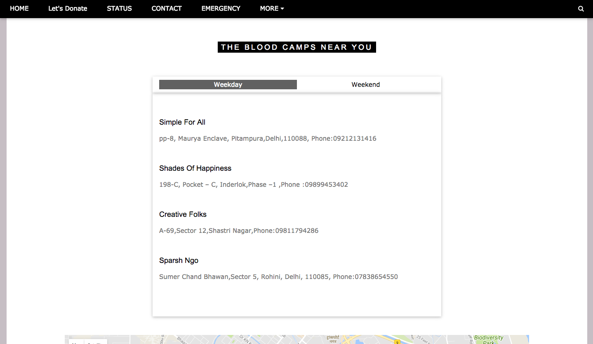

# Blood-Donation

Blood Donation Project.

Basically it provides assitance to the people who take the innitiate to donate blood.
The projects maps out the places near our residence and makes us aware about the blood camps near our area.
There is also a status page where it shows the status of all the blood groups.
This status will be shown to the hospitals in village areas and interiors!
Requests will be send accordingly to the website when the blood is required.

Its just the front-end part now!
Working on the backend part and would store the data in the database.

#### This will help the hospitals in village areas and it will reduce the availablity of blood when required.

